# Лабораторная работа №2  
# Однослойный перцептрон для бинарной классификации
### Выполнила Тимохина Елизавета (Б25-507)

---

# Постановка задачи

Цель работы — реализовать однослойный перцептрон для задачи бинарной классификации без использования готовых моделей машинного обучения.

В рамках лабораторной работы необходимо:

- реализовать обучение однослойного перцептрона с нуля;
- реализовать mini-batch gradient descent;
- реализовать binary cross-entropy и hinge loss;
- реализовать L2-регуляризацию;
- вручную реализовать метрики качества;
- провести эксперименты с learning rate, batch size и инициализацией весов;
- реализовать собственные генераторы данных;
- выполнить подбор гиперпараметров через k-fold cross-validation;
- визуализировать результаты обучения и разделяющие границы.

---

# Ход работы

## 1. Подготовка данных

Для базового эксперимента был сгенерирован синтетический датасет бинарной классификации с двумя признаками.

Использовалось:

- 500 объектов;
- 2 информативных признака;
- 2 класса.

Данные были разделены на обучающую и тестовую выборки в пропорции 70/30 со стратификацией.

После этого признаки были стандартизированы по формуле:

```text
x_scaled = (x - mean) / std
```

где `mean` и `std` вычислялись только по обучающей выборке.

---

## Исходные данные

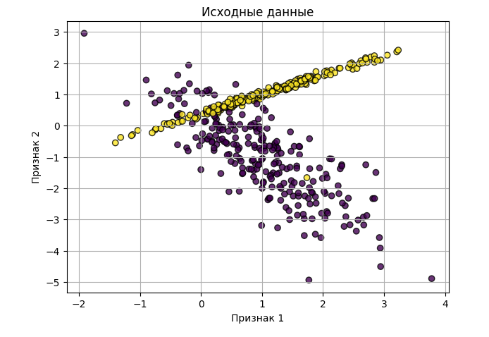

---

## 2. Обучение базовой модели

Была реализована модель однослойного перцептрона с:

- функцией потерь BCE;
- сигмоидной активацией;
- mini-batch gradient descent.

Модель обучалась с параметрами:

```text
learning rate = 0.1
epochs = 100
batch size = 32
```

---

## Изменение функции потерь

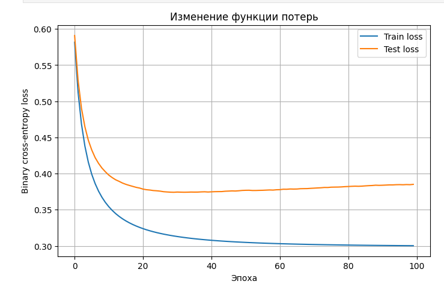

График показывает уменьшение функции потерь на обучающей и тестовой выборках.

Train loss стабильно уменьшается, test loss сначала уменьшается, а затем стабилизируется.

---

## Разделяющая граница

### Обучающая выборка

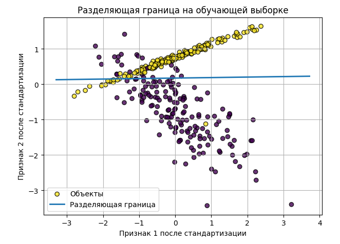

### Тестовая выборка

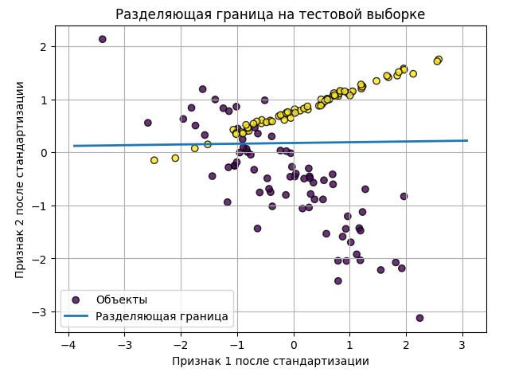

Разделяющая граница задаётся уравнением:

```text
w1*x1 + w2*x2 + b = 0
```

Так как используется однослойный перцептрон, граница решения всегда является прямой.

---

# Краткое описание реализованных алгоритмов

## Однослойный перцептрон

Модель вычисляет линейную комбинацию признаков:

```text
z = w^T x + b
```

где:

- `x` — вектор признаков;
- `w` — вектор весов;
- `b` — смещение.

Для BCE используется сигмоида:

```text
sigmoid(z) = 1 / (1 + exp(-z))
```

Она преобразует линейный score в вероятность класса 1.

---

## Binary Cross-Entropy

Используется функция потерь:

```text
L = -mean(y * log(y_pred) + (1 - y) * log(1 - y_pred))
```

BCE сильно штрафует модель за уверенные неправильные предсказания.

---

## Hinge Loss

Также реализован hinge loss:

```text
L = mean(max(0, 1 - y * score))
```

Для него метки преобразуются из:

```text
0/1 -> -1/+1
```

---

## Mini-batch Gradient Descent

Обновление весов выполняется по формуле:

```text
w := w - lr * dL/dw
b := b - lr * dL/db
```

где:

- `lr` — learning rate;
- `dL/dw` — градиент функции потерь.

Обучение выполняется по мини-батчам.

---

## L2-регуляризация

Для BCE и hinge loss реализована L2-регуляризация:

```text
0.5 * lambda * ||w||²
```

Она штрафует слишком большие веса и помогает контролировать сложность модели.

---

# Структура программы

Проект разбит на несколько файлов.

```text
linal_laba_2/
├── main.py
├── perceptron.py
├── data.py
├── metrics.py
├── visualization.py
├── experiments.py
├── requirements.txt
└── notebooks/
    └── lab_2.ipynb
```

---

## `perceptron.py`

Содержит:

- класс `SingleLayerPerceptron`;
- sigmoid;
- BCE loss;
- hinge loss;
- вычисление градиентов;
- mini-batch gradient descent;
- predict/predict_proba.

---

## `data.py`

Содержит:

- stratified train/test split;
- стандартизацию;
- генераторы данных;
- добавление шума в метки.

---

## `metrics.py`

Содержит ручную реализацию:

- accuracy;
- precision;
- recall;
- F1-score;
- confusion matrix.

---

## `visualization.py`

Содержит функции для построения:

- графиков loss;
- scatter plot;
- разделяющей границы;
- сравнительных графиков экспериментов.

---

## `experiments.py`

Содержит:

- запуск экспериментов;
- cross-validation;
- подбор гиперпараметров.

---

## `main.py`

Главный файл проекта.

Выполняет:

1. подготовку данных;
2. обучение базовой модели;
3. запуск экспериментов;
4. запуск дополнительных заданий;
5. обучение финальной модели.

---

# Результаты экспериментов

# Эксперимент 1 — влияние learning rate

Проверялись значения:

```text
0.001
0.01
0.5
1.0
```

---

## График

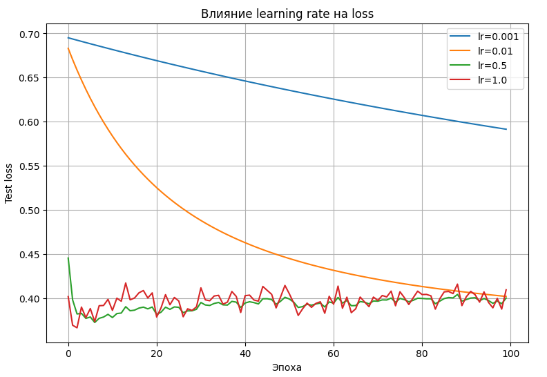

---

## Таблица результатов

| learning rate | train accuracy | test accuracy |
|---|---:|---:|
| 0.001 | 0.8771 | 0.8333 |
| 0.01 | 0.8714 | 0.8533 |
| 0.5 | 0.8886 | 0.8667 |
| 1.0 | 0.8914 | 0.8667 |

---

## Вывод

Маленький learning rate приводит к медленному обучению.

Слишком большой learning rate может вызывать нестабильность.

Лучшие результаты были получены при:

```text
lr = 0.5 и lr = 1.0
```

---

# Эксперимент 2 — влияние batch size

Проверялись:

```text
1
16
64
256
```

---

## График

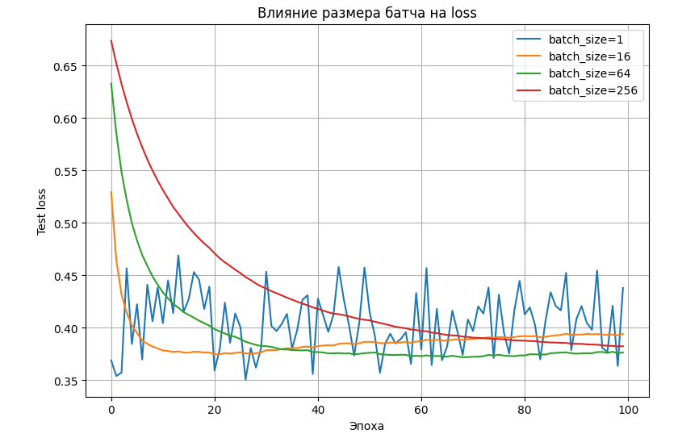

---

## Таблица результатов

| batch size | train accuracy | test accuracy |
|---:|---:|---:|
| 1 | 0.9000 | 0.8667 |
| 16 | 0.8829 | 0.8667 |
| 64 | 0.8800 | 0.8600 |
| 256 | 0.8800 | 0.8667 |

---

## Вывод

Маленький batch size даёт более шумные обновления, но иногда помогает быстрее находить хороший минимум.

Большие batch size дают более стабильный градиент.

---

# Эксперимент 3 — влияние инициализации весов

Сравнивались:

```text
zeros
small_random
large_random
```

---

## График

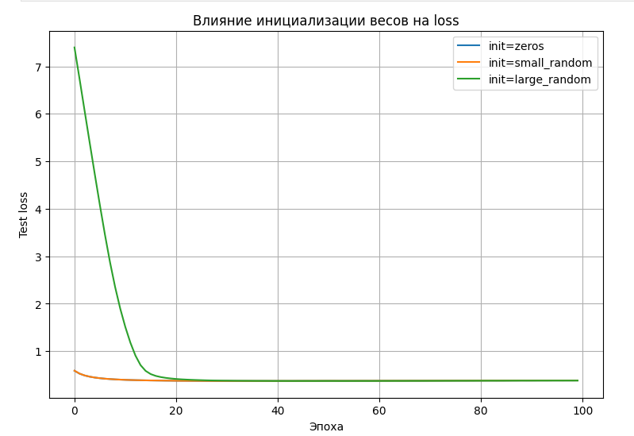

---

## Результаты

| init type | train accuracy | test accuracy |
|---|---:|---:|
| zeros | 0.8800 | 0.8600 |
| small_random | 0.8800 | 0.8600 |
| large_random | 0.8800 | 0.8600 |

---

## Вывод

На данном датасете различия между инициализациями оказались небольшими.

Большая случайная инициализация приводит к более высокому начальному loss из-за насыщения сигмоиды.

---

# Дополнительное задание 1 — собственные генераторы данных

Были реализованы:

1. линейно разделимые гауссовы облака;
2. XOR;
3. окружность.

---

## Линейно разделимые гауссовы облака

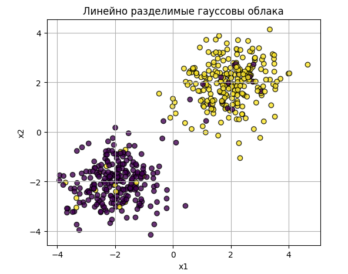

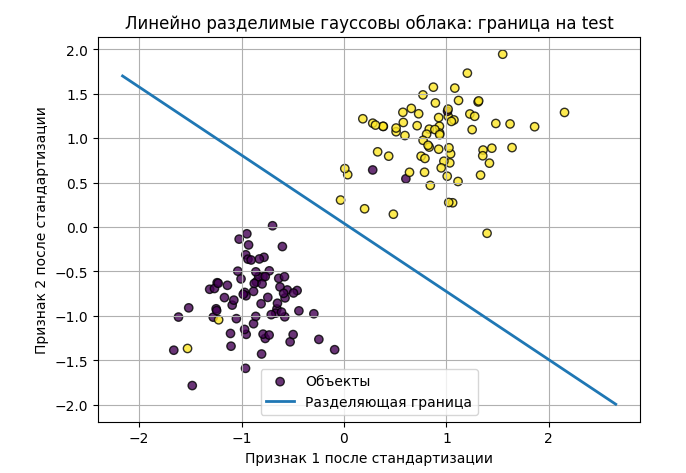

---

## XOR

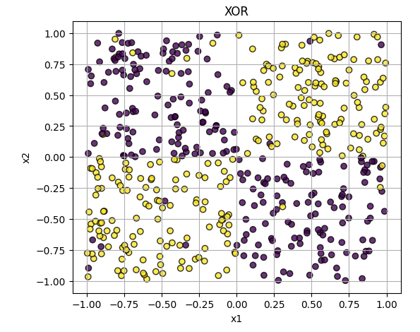

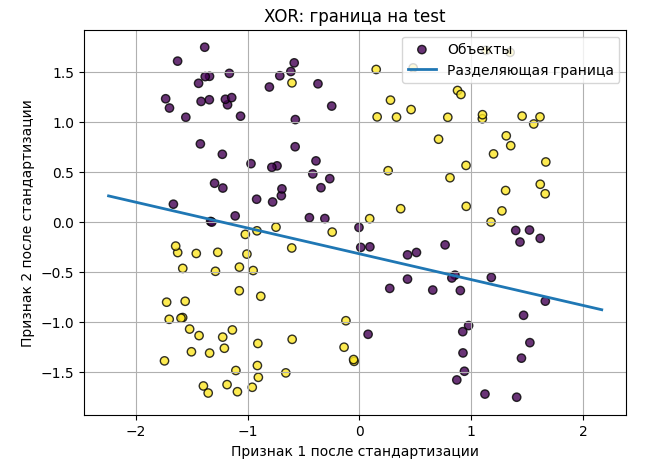

---

## Окружность

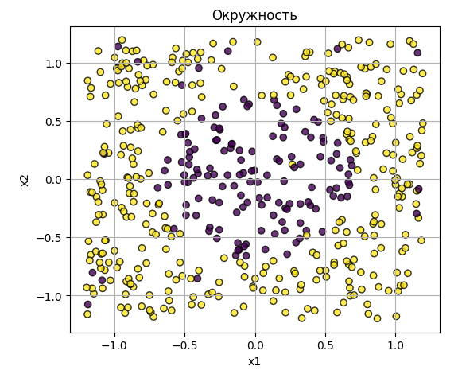

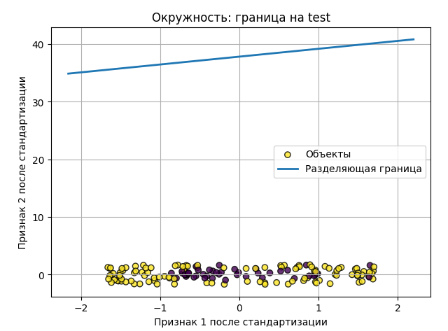

---

## Результаты

| dataset | accuracy |
|---|---:|
| Gaussian | 0.9667 |
| XOR | 0.3600 |
| Circle | 0.7067 |

---

## Вывод

Однослойный перцептрон хорошо работает только на линейно разделимых данных.

XOR и окружность невозможно корректно разделить одной прямой.

---

# Дополнительное задание 2 — hinge loss и L2-регуляризация

---

## BCE vs Hinge Loss

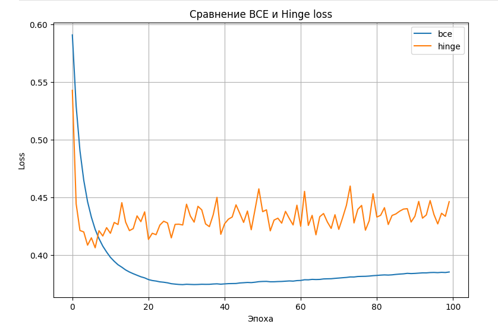

---

| loss type | train accuracy | test accuracy |
|---|---:|---:|
| BCE | 0.8800 | 0.8600 |
| Hinge | 0.9171 | 0.8800 |

---

## Вывод

Hinge loss показал немного более высокую accuracy на тестовой выборке.

BCE удобна тем, что позволяет интерпретировать результат как вероятность.

---

## L2-регуляризация

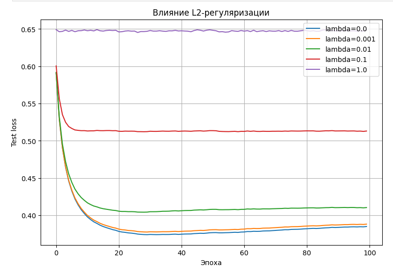

---

| lambda | test accuracy |
|---:|---:|
| 0.0 | 0.8600 |
| 0.001 | 0.8600 |
| 0.01 | 0.8667 |
| 0.1 | 0.8533 |
| 1.0 | 0.8333 |

---

## Вывод

При увеличении коэффициента регуляризации веса уменьшаются.

Слишком большая регуляризация ухудшает качество модели и приводит к недообучению.

---

# Дополнительное задание 5 — cross-validation

Для подбора гиперпараметров была реализована 5-fold cross-validation.

Лучшие параметры:

```text
learning rate = 0.5
batch size = 16
```

---

# Финальная модель

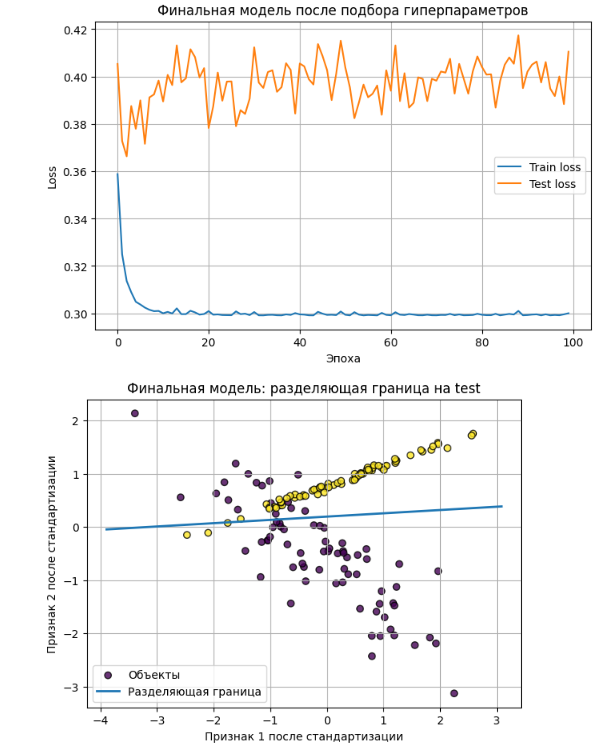

---

## Результаты финальной модели

### Train

```text
accuracy  = 0.8914
precision = 0.8557
recall    = 0.9432
F1-score  = 0.8973
```

### Test

```text
accuracy  = 0.8667
precision = 0.8090
recall    = 0.9600
F1-score  = 0.8780
```

---

# Выводы

В ходе лабораторной работы был реализован однослойный перцептрон для бинарной классификации с нуля.

Были вручную реализованы:

- функции потерь BCE и hinge loss;
- mini-batch gradient descent;
- L2-регуляризация;
- метрики качества;
- генераторы данных;
- cross-validation.

Основные выводы:

1. Однослойный перцептрон хорошо работает только на линейно разделимых данных.
2. XOR и окружность невозможно корректно разделить одной прямой.
3. Learning rate сильно влияет на скорость и стабильность обучения.
4. Batch size влияет на шумность градиента.
5. L2-регуляризация уменьшает норму весов, но слишком большая регуляризация ухудшает качество.
6. Cross-validation помогает подобрать более удачные гиперпараметры.

Работа позволила изучить основные принципы линейной классификации и обучения модели методом градиентного спуска.